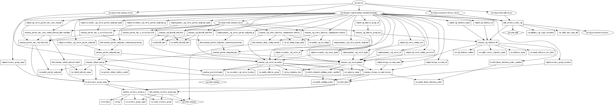

# Azure SQL Database Terraform Module

Terraform module to create an MS SQL server with initial database, Azure AD login, Firewall rules, geo-replication using auto-failover groups, Private endpoints, and corresponding private DNS zone. It also supports creating a database with a custom SQL script initialization.

A single database is the quickest and simplest deployment option for Azure SQL Database. You manage a single database within a SQL Database server, which is inside an Azure resource group in a specified Azure region with this module.

You can also create a single database in the provisioned or serverless compute tier. A provisioned database is pre-allocated a fixed amount of computing resources, including CPU and memory, and uses one of two purchasing models. This module creates a provisioned database using the vCore-based purchasing model, but you can choose a DTU-based model as well.

## Resources supported

* [SQL Servers](https://www.terraform.io/docs/providers/azurerm/r/sql_server.html)
* [SQL Database](https://www.terraform.io/docs/providers/azurerm/r/mysql_database.html)
* [Storage account for diagnostics](https://www.terraform.io/docs/providers/azurerm/r/storage_account.html)
* [Active Directory Administrator](https://www.terraform.io/docs/providers/azurerm/r/sql_active_directory_administrator.html)
* [Firewall rule for azure services, resources, and client IP](https://www.terraform.io/docs/providers/azurerm/r/sql_firewall_rule.html)
* [SQL Auto-Failover Group](https://www.terraform.io/docs/providers/azurerm/r/sql_failover_group.html)
* [Private Endpoints](https://www.terraform.io/docs/providers/azurerm/r/private_endpoint.html)
* [Private DNS zone for `privatelink` A records](https://www.terraform.io/docs/providers/azurerm/r/private_dns_zone.html)
* [SQL Script execution to create Database](https://docs.microsoft.com/en-us/sql/ssms/scripting/sqlcmd-run-transact-sql-script-files?view=sql-server-ver15)
* [SQL Server and Database Extended Auditing Policy](https://docs.microsoft.com/en-us/azure/azure-sql/database/auditing-overview)
* [Azure Defender for SQL](https://docs.microsoft.com/en-us/azure/azure-sql/database/azure-defender-for-sql)
* [SQL Vulnerability Assessment](https://docs.microsoft.com/en-us/azure/azure-sql/database/sql-vulnerability-assessment)
* [SQL Log Monitoring and Diagnostics](https://docs.microsoft.com/en-us/azure/azure-sql/database/metrics-diagnostic-telemetry-logging-streaming-export-configure?tabs=azure-portal)

## Module Usage

```terraform
# Azurerm provider configuration
provider "azurerm" {
  features {}
}

data "azurerm_log_analytics_workspace" "example" {
  name                = "loganalytics-we-sharedtest2"
  resource_group_name = "rg-shared-westeurope-01"
}

module "mssql-server" {
  source  = "kumarvna/mssql-db/azurerm"
  version = "1.3.0"

  # By default, this module will create a resource group
  # proivde a name to use an existing resource group and set the argument 
  # to `create_resource_group = false` if you want to existing resoruce group. 
  # If you use existing resrouce group location will be the same as existing RG.
  create_resource_group = false
  resource_group_name   = "rg-shared-westeurope-01"
  location              = "westeurope"

  # SQL Server and Database details
  # The valid service objective name for the database include S0, S1, S2, S3, P1, P2, P4, P6, P11 
  sqlserver_name               = "te-sqldbserver01"
  database_name                = "demomssqldb"
  sql_database_edition         = "Standard"
  sqldb_service_objective_name = "S1"

  # SQL server extended auditing policy defaults to `true`. 
  # To turn off set enable_sql_server_extended_auditing_policy to `false`  
  # DB extended auditing policy defaults to `false`. 
  # to tun on set the variable `enable_database_extended_auditing_policy` to `true` 
  # To enable Azure Defender for database set `enable_threat_detection_policy` to true 
  enable_threat_detection_policy = true
  log_retention_days             = 30

  # schedule scan notifications to the subscription administrators
  # Manage Vulnerability Assessment set `enable_vulnerability_assessment` to `true`
  enable_vulnerability_assessment = false
  email_addresses_for_alerts      = ["user@example.com", "firstname.lastname@example.com"]

  # AD administrator for an Azure SQL server
  # Allows you to set a user or group as the AD administrator for an Azure SQL server
  ad_admin_login_name = "firstname.lastname@example.com"

  # (Optional) To enable Azure Monitoring for Azure SQL database including audit logs
  # Log Analytic workspace resource id required
  # (Optional) Specify `storage_account_id` to save monitoring logs to storage. 
  enable_log_monitoring      = true
  log_analytics_workspace_id = data.azurerm_log_analytics_workspace.example.id

  # Firewall Rules to allow azure and external clients and specific Ip address/ranges. 
  enable_firewall_rules = true
  firewall_rules = [
    {
      name             = "access-to-azure"
      start_ip_address = "0.0.0.0"
      end_ip_address   = "0.0.0.0"
    },
    {
      name             = "desktop-ip"
      start_ip_address = "49.204.225.49"
      end_ip_address   = "49.204.225.49"
    }
  ]

  # Adding additional TAG's to your Azure resources
  tags = {
    ProjectName  = "demo-project"
    Env          = "dev"
    Owner        = "user@example.com"
    BusinessUnit = "CORP"
    ServiceClass = "Gold"
  }
}
```

## Default Local Administrator and the Password

This module utilizes __`sqladmin`__ as a local administrator on SQL servers. If you want to you use custom username, then specify the same by setting up the argument `admin_username` with a valid user string.

By default, this module generates a strong password for all virtual machines also allows you to change the length of the random password (currently 24) using the `random_password_length = 32` variable. If you want to set the custom password, specify the argument `admin_password` with a valid string.

### Resource Group

By default, this module will create a resource group. To use the existing resource group, set the arguments `create_resource_group = false` and provide a valid resource group name with`resource_group_name`.

*If you are using an existing resource group, then this module uses the same resource group location to create all resources in this module.*

## Advance usage of module

### `extended_auditing_policy` - Auditing for SQL Database

Auditing for Azure SQL Database and servers tracks database events and writes them to an audit log in an Azure storage account. If server auditing is enabled, it always applies to the database. The database will be audited, regardless of the database auditing settings.

By default, this feature enabled on SQL servers. To manage the threat detection policy for the severs set `enable_sql_server_extended_auditing_policy`to valid string. For database auditing, set the argument `enable_database_extended_auditing_policy` to `true`

### `threat_detection_policy` - SQL Database Advanced Threat Protection

Advanced Threat Protection for single and pooled databases detects anomalous activities indicating unusual and potentially harmful attempts to access or exploit databases. Advanced Threat Protection can identify Potential SQL injection, Access from an unusual location or data center, Access from the unfamiliar principal or potentially harmful application, and Brute force SQL credentials - see more details in Advanced Threat Protection alerts.

By default, this feature not enabled on this module. To enable the threat detection policy for the database, set the argument `enable_threat_detection_policy = true`.

> #### Note: Enabling `extended_auditing_policy` and `threat_detection_policy` features on SQL servers and database going to create a storage account to keep all audit logs. Log retention policy to be configured to keep the size within limits for this storage account. Note that this module creates resources that can cost money

### Adding Active Directory Administrator to SQL Database

Azure Active Directory authentication is a mechanism of connecting to Microsoft Azure SQL Database by using identities in Azure Active Directory (Azure AD). This module adds the provided Azure Active Directory user/group to SQL Database as an administrator so that the user can login to this database with Azure AD authentication.

By default, this feature not enabled on this module. To add the Active Directory Administrator to SQL database, set the argument `ad_admin_login_name` with a valid Azure AD user login name.

### Configuring the Azure SQL Database Firewall

The Azure SQL Database firewall lets you decide which IP addresses may or may not have access to your Azure SQL Server or your Azure SQL database.  When creating an Azure SQL Database, one must add firewall rules before anyone to access the database.

By default, no external access to your SQL Database will be allowed until you explicitly assign permission by creating a firewall rule. To add the firewall rules to the SQL database, set the argument `enable_firewall_rules = true` and provide the required IP ranges.

> #### Additionally, If you enable Private endpoint feature, firewall rules are not relevant. It does not require adding any IP addresses to the firewall on Azure SQL Database or changing the connection string of your application for private links

### Azure SQL Geo-Replication and Failover Groups

Microsoft Azure offers different types of business continuity solutions for their SQL database. One of these solutions is Geo-Replication that provides an asynchronous database copy. You can store this copy in the same or different regions. You can setup up to four readable database copies. If we want to automate and make (users will not affect) failover mechanism transparent, we have to create the auto-failover group.

You can put several single databases on the same SQL Database server into the same failover group. If you add a single database to the failover group, it automatically creates a secondary database using the same edition and the compute size on the secondary server.

For more information, check the [Microsoft Documentation](https://docs.microsoft.com/en-us/azure/azure-sql/database/active-geo-replication-overview)

By default, this feature not enabled on this module. To create SQL geo-replicated auto-failover groups, set the argument `enable_failover_group = true`. To create a failover group, set the secondary server location argument `secondary_sql_server_location` to a valid region.

### Using Failover Groups with Private Link for Azure SQL Database

Azure SQL Database offers the ability to manage geo-replication and failover of a group of databases by adding them to the failover group.  A failover group spans two servers – a primary server where the databases are accessed by the end-user or application & a secondary server in a different region where a copy of each database is kept in sync using active geo-replication.

Azure Private Endpoint is a network interface that connects you privately and securely to a service powered by Azure Private Link. Private Endpoint uses a private IP address from your VNet, effectively bringing the service into your VNet.

With Private Link, Microsoft offering the ability to associate a logical server to a specific private IP address (also known as private endpoint) within the VNet. This module helps to implement Failover Groups using private endpoint for SQL Database instead of the public endpoint thus ensuring that customers can get security benefits that it offers.

By default, this feature not enabled on this module. To create private link with private endpoints set the variable `enable_private_endpoint` to `true` and provide `virtual_network_name`, `private_subnet_address_prefix` with a valid values. You can also use the existing private DNS zone to create DNS records. To use this feature, set the `existing_private_dns_zone` with a valid existing private DNS zone name.

```terraform
module "mssql-server" {
  source  = "kumarvna/mssql-db/azurerm"
  version = "1.3.0"

  # .... omitted

  # Creating Private Endpoint requires, VNet name and address prefix to create a subnet
  # By default this will create a `privatelink.database.windows.net` DNS zone. 
  # To use existing private DNS zone specify `existing_private_dns_zone` with valid zone name
  enable_private_endpoint       = true
  virtual_network_name          = "vnet-shared-hub-westeurope-001"
  private_subnet_address_prefix = ["10.1.5.0/29"]
  # existing_private_dns_zone = "demo.example.com"

  # ....omitted

}
```

If you want to use eixsting VNet and Subnet to create a private endpoints, set a variable `enable_private_endpoint` to `true` and provide `existing_vnet_id`, `existing_subnet_id` with a valid resource ids. You can also use the existing private DNS zone to create DNS records. To use this feature, set the `existing_private_dns_zone` with a valid existing private DNS zone name.

```terraform
module "mssql-server" {
  source  = "kumarvna/mssql-db/azurerm"
  version = "1.3.0"

  # .... omitted

  # Creating Private Endpoint requires, VNet name and address prefix to create a subnet
  # By default this will create a `privatelink.database.windows.net` DNS zone. 
  # To use existing private DNS zone specify `existing_private_dns_zone` with valid zone name
  enable_private_endpoint = true
  existing_vnet_id        = data.azurerm_virtual_network.example.id
  existing_subnet_id      = data.azurerm_subnet.example.id
  # existing_private_dns_zone     = "demo.example.com"

  # ....omitted

}
```

### Create schema and Initialize SQL Database

This module uses the tool slqcmd as a local provisioner to connect and inject the SQL initialization. To enable this feature set the argument `initialize_sql_script_execution = true` and use `sqldb_init_script_file` argument to provide the path to SQL script.

> #### Note: To create SQL database schema using SQL script from your desktop requires the addition of a firewall rule. Add your machine public IP to firewall rules to run this feature else this will fail to run and exit the terraform plan

Installation of the Microsoft `sqlcmd` utility on [Ubuntu](https://docs.microsoft.com/en-us/sql/linux/sql-server-linux-setup-tools?view=sql-server-ver15#ubuntu) or on [Windows](https://docs.microsoft.com/en-us/sql/tools/sqlcmd-utility?view=sql-server-ver15) found here.

```terraform
module "mssql-server" {
  source  = "kumarvna/mssql-db/azurerm"
  version = "1.3.0"

  # .... omitted

  # Create and initialize a database with custom SQL script
  # need sqlcmd utility to run this command 
  # your desktop public IP must be added to firewall rules to run this command 
  initialize_sql_script_execution = true
  sqldb_init_script_file          = "../artifacts/db-init-sample.sql"

  # ....omitted

}
```

## Recommended naming and tagging conventions

Applying tags to your Azure resources, resource groups, and subscriptions to logically organize them into a taxonomy. Each tag consists of a name and a value pair. For example, you can apply the name `Environment` and the value `Production` to all the resources in production.
For recommendations on how to implement a tagging strategy, see Resource naming and tagging decision guide.

>**Important** :
Tag names are case-insensitive for operations. A tag with a tag name, regardless of the casing, is updated or retrieved. However, the resource provider might keep the casing you provide for the tag name. You'll see that casing in cost reports. **Tag values are case-sensitive.**

An effective naming convention assembles resource names by using important resource information as parts of a resource's name. For example, using these [recommended naming conventions](https://docs.microsoft.com/en-us/azure/cloud-adoption-framework/ready/azure-best-practices/naming-and-tagging#example-names), a public IP resource for a production SharePoint workload is named like this: `pip-sharepoint-prod-westus-001`.

## Requirements

| Name | Version |
|------|---------|
| <a name="requirement_terraform"></a> [terraform](#requirement\_terraform) | >= 0.13 |
| <a name="requirement_azurerm"></a> [azurerm](#requirement\_azurerm) | >= 2.59.0 |
| <a name="requirement_null"></a> [null](#requirement\_null) | >= 3.1.0 |
| <a name="requirement_random"></a> [random](#requirement\_random) | >= 3.1.0 |

## Providers

| Name | Version |
|------|---------|
| <a name="provider_azurerm"></a> [azurerm](#provider\_azurerm) | >= 2.59.0 |
| <a name="provider_null"></a> [null](#provider\_null) | >= 3.1.0 |
| <a name="provider_random"></a> [random](#provider\_random) | >= 3.1.0 |

## Modules

No modules.

## Resources

| Name | Type |
|------|------|
| [azurerm_monitor_diagnostic_setting.extaudit](https://registry.terraform.io/providers/hashicorp/azurerm/latest/docs/resources/monitor_diagnostic_setting) | resource |
| [azurerm_mssql_database_extended_auditing_policy.primary](https://registry.terraform.io/providers/hashicorp/azurerm/latest/docs/resources/mssql_database_extended_auditing_policy) | resource |
| [azurerm_mssql_server.primary](https://registry.terraform.io/providers/hashicorp/azurerm/latest/docs/resources/mssql_server) | resource |
| [azurerm_mssql_server.secondary](https://registry.terraform.io/providers/hashicorp/azurerm/latest/docs/resources/mssql_server) | resource |
| [azurerm_mssql_server_extended_auditing_policy.primary](https://registry.terraform.io/providers/hashicorp/azurerm/latest/docs/resources/mssql_server_extended_auditing_policy) | resource |
| [azurerm_mssql_server_extended_auditing_policy.secondary](https://registry.terraform.io/providers/hashicorp/azurerm/latest/docs/resources/mssql_server_extended_auditing_policy) | resource |
| [azurerm_mssql_server_security_alert_policy.sap_primary](https://registry.terraform.io/providers/hashicorp/azurerm/latest/docs/resources/mssql_server_security_alert_policy) | resource |
| [azurerm_mssql_server_security_alert_policy.sap_secondary](https://registry.terraform.io/providers/hashicorp/azurerm/latest/docs/resources/mssql_server_security_alert_policy) | resource |
| [azurerm_mssql_server_vulnerability_assessment.va_primary](https://registry.terraform.io/providers/hashicorp/azurerm/latest/docs/resources/mssql_server_vulnerability_assessment) | resource |
| [azurerm_mssql_server_vulnerability_assessment.va_secondary](https://registry.terraform.io/providers/hashicorp/azurerm/latest/docs/resources/mssql_server_vulnerability_assessment) | resource |
| [azurerm_private_dns_a_record.arecord1](https://registry.terraform.io/providers/hashicorp/azurerm/latest/docs/resources/private_dns_a_record) | resource |
| [azurerm_private_dns_a_record.arecord2](https://registry.terraform.io/providers/hashicorp/azurerm/latest/docs/resources/private_dns_a_record) | resource |
| [azurerm_private_dns_zone.dnszone1](https://registry.terraform.io/providers/hashicorp/azurerm/latest/docs/resources/private_dns_zone) | resource |
| [azurerm_private_dns_zone_virtual_network_link.vent-link1](https://registry.terraform.io/providers/hashicorp/azurerm/latest/docs/resources/private_dns_zone_virtual_network_link) | resource |
| [azurerm_private_endpoint.pep1](https://registry.terraform.io/providers/hashicorp/azurerm/latest/docs/resources/private_endpoint) | resource |
| [azurerm_private_endpoint.pep2](https://registry.terraform.io/providers/hashicorp/azurerm/latest/docs/resources/private_endpoint) | resource |
| [azurerm_resource_group.rg](https://registry.terraform.io/providers/hashicorp/azurerm/latest/docs/resources/resource_group) | resource |
| [azurerm_sql_active_directory_administrator.aduser1](https://registry.terraform.io/providers/hashicorp/azurerm/latest/docs/resources/sql_active_directory_administrator) | resource |
| [azurerm_sql_active_directory_administrator.aduser2](https://registry.terraform.io/providers/hashicorp/azurerm/latest/docs/resources/sql_active_directory_administrator) | resource |
| [azurerm_sql_database.db](https://registry.terraform.io/providers/hashicorp/azurerm/latest/docs/resources/sql_database) | resource |
| [azurerm_sql_failover_group.fog](https://registry.terraform.io/providers/hashicorp/azurerm/latest/docs/resources/sql_failover_group) | resource |
| [azurerm_sql_firewall_rule.fw01](https://registry.terraform.io/providers/hashicorp/azurerm/latest/docs/resources/sql_firewall_rule) | resource |
| [azurerm_sql_firewall_rule.fw02](https://registry.terraform.io/providers/hashicorp/azurerm/latest/docs/resources/sql_firewall_rule) | resource |
| [azurerm_storage_account.storeacc](https://registry.terraform.io/providers/hashicorp/azurerm/latest/docs/resources/storage_account) | resource |
| [azurerm_storage_container.storcont](https://registry.terraform.io/providers/hashicorp/azurerm/latest/docs/resources/storage_container) | resource |
| [azurerm_subnet.snet-ep](https://registry.terraform.io/providers/hashicorp/azurerm/latest/docs/resources/subnet) | resource |
| [null_resource.create_sql](https://registry.terraform.io/providers/hashicorp/null/latest/docs/resources/resource) | resource |
| [random_password.main](https://registry.terraform.io/providers/hashicorp/random/latest/docs/resources/password) | resource |
| [random_string.str](https://registry.terraform.io/providers/hashicorp/random/latest/docs/resources/string) | resource |
| [azurerm_client_config.current](https://registry.terraform.io/providers/hashicorp/azurerm/latest/docs/data-sources/client_config) | data source |
| [azurerm_private_endpoint_connection.private-ip1](https://registry.terraform.io/providers/hashicorp/azurerm/latest/docs/data-sources/private_endpoint_connection) | data source |
| [azurerm_private_endpoint_connection.private-ip2](https://registry.terraform.io/providers/hashicorp/azurerm/latest/docs/data-sources/private_endpoint_connection) | data source |
| [azurerm_resource_group.rgrp](https://registry.terraform.io/providers/hashicorp/azurerm/latest/docs/data-sources/resource_group) | data source |
| [azurerm_virtual_network.vnet01](https://registry.terraform.io/providers/hashicorp/azurerm/latest/docs/data-sources/virtual_network) | data source |

## Inputs

| Name | Description | Type | Default | Required |
|------|-------------|------|---------|:--------:|
| <a name="input_ad_admin_login_name"></a> [ad\_admin\_login\_name](#input\_ad\_admin\_login\_name) | The login name of the principal to set as the server administrator | `any` | `null` | no |
| <a name="input_admin_password"></a> [admin\_password](#input\_admin\_password) | The password associated with the admin\_username user | `any` | `null` | no |
| <a name="input_admin_username"></a> [admin\_username](#input\_admin\_username) | The administrator login name for the new SQL Server | `any` | `null` | no |
| <a name="input_create_private_dns_zone"></a> [create\_private\_dns\_zone](#input\_create\_private\_dns\_zone) | Whether or not to create a private DNS zone if existing\_private\_dns\_zone is set to null, e.g. if there is already a DNS zone creatted in a shared subscription and the DNS record is deployed by policy | `bool` | `true` | no |
| <a name="input_create_resource_group"></a> [create\_resource\_group](#input\_create\_resource\_group) | Whether to create resource group and use it for all networking resources | `bool` | `true` | no |
| <a name="input_database_name"></a> [database\_name](#input\_database\_name) | The name of the database; DEPRECATED - use 'databases' | `string` | `""` | no |
| <a name="input_databases"></a> [databases](#input\_databases) | The list of databases to create | <pre>list(object({<br>    name                   = string<br>    edition                = string<br>    service_objective_name = string<br>    sqldb_init_script_file = string<br>  }))</pre> | `[]` | no |
| <a name="input_disabled_alerts"></a> [disabled\_alerts](#input\_disabled\_alerts) | Specifies an array of alerts that are disabled. Allowed values are: Sql\_Injection, Sql\_Injection\_Vulnerability, Access\_Anomaly, Data\_Exfiltration, Unsafe\_Action. | `list(any)` | `[]` | no |
| <a name="input_email_addresses_for_alerts"></a> [email\_addresses\_for\_alerts](#input\_email\_addresses\_for\_alerts) | A list of email addresses which alerts should be sent to. | `list(any)` | `[]` | no |
| <a name="input_enable_database_extended_auditing_policy"></a> [enable\_database\_extended\_auditing\_policy](#input\_enable\_database\_extended\_auditing\_policy) | Manages Extended Audit policy for SQL database | `bool` | `false` | no |
| <a name="input_enable_failover_group"></a> [enable\_failover\_group](#input\_enable\_failover\_group) | Create a failover group of databases on a collection of Azure SQL servers | `bool` | `false` | no |
| <a name="input_enable_firewall_rules"></a> [enable\_firewall\_rules](#input\_enable\_firewall\_rules) | Manage an Azure SQL Firewall Rule | `bool` | `false` | no |
| <a name="input_enable_log_monitoring"></a> [enable\_log\_monitoring](#input\_enable\_log\_monitoring) | Enable audit events to Azure Monitor? | `bool` | `false` | no |
| <a name="input_enable_private_endpoint"></a> [enable\_private\_endpoint](#input\_enable\_private\_endpoint) | Manages a Private Endpoint to SQL database | `bool` | `false` | no |
| <a name="input_enable_sql_server_extended_auditing_policy"></a> [enable\_sql\_server\_extended\_auditing\_policy](#input\_enable\_sql\_server\_extended\_auditing\_policy) | Manages Extended Audit policy for SQL servers | `bool` | `true` | no |
| <a name="input_enable_threat_detection_policy"></a> [enable\_threat\_detection\_policy](#input\_enable\_threat\_detection\_policy) | n/a | `bool` | `false` | no |
| <a name="input_enable_vulnerability_assessment"></a> [enable\_vulnerability\_assessment](#input\_enable\_vulnerability\_assessment) | Manages the Vulnerability Assessment for a MS SQL Server | `bool` | `false` | no |
| <a name="input_existing_private_dns_zone"></a> [existing\_private\_dns\_zone](#input\_existing\_private\_dns\_zone) | Name of the existing private DNS zone | `any` | `null` | no |
| <a name="input_existing_subnet_id"></a> [existing\_subnet\_id](#input\_existing\_subnet\_id) | The resource id of existing subnet | `any` | `null` | no |
| <a name="input_existing_vnet_id"></a> [existing\_vnet\_id](#input\_existing\_vnet\_id) | The resoruce id of existing Virtual network | `any` | `null` | no |
| <a name="input_extaudit_diag_logs"></a> [extaudit\_diag\_logs](#input\_extaudit\_diag\_logs) | Database Monitoring Category details for Azure Diagnostic setting | `list` | <pre>[<br>  "SQLSecurityAuditEvents",<br>  "SQLInsights",<br>  "AutomaticTuning",<br>  "QueryStoreRuntimeStatistics",<br>  "QueryStoreWaitStatistics",<br>  "Errors",<br>  "DatabaseWaitStatistics",<br>  "Timeouts",<br>  "Blocks",<br>  "Deadlocks"<br>]</pre> | no |
| <a name="input_firewall_rules"></a> [firewall\_rules](#input\_firewall\_rules) | Range of IP addresses to allow firewall connections. | <pre>list(object({<br>    name             = string<br>    start_ip_address = string<br>    end_ip_address   = string<br>  }))</pre> | `[]` | no |
| <a name="input_identity"></a> [identity](#input\_identity) | If you want your SQL Server to have an managed identity. Defaults to false. | `bool` | `false` | no |
| <a name="input_initialize_sql_script_execution"></a> [initialize\_sql\_script\_execution](#input\_initialize\_sql\_script\_execution) | Allow/deny to Create and initialize a Microsoft SQL Server database | `bool` | `false` | no |
| <a name="input_location"></a> [location](#input\_location) | The location/region to keep all your network resources. To get the list of all locations with table format from azure cli, run 'az account list-locations -o table' | `string` | `""` | no |
| <a name="input_log_analytics_workspace_id"></a> [log\_analytics\_workspace\_id](#input\_log\_analytics\_workspace\_id) | Specifies the ID of a Log Analytics Workspace where Diagnostics Data to be sent | `any` | `null` | no |
| <a name="input_log_retention_days"></a> [log\_retention\_days](#input\_log\_retention\_days) | Specifies the number of days to keep in the Threat Detection audit logs | `string` | `"30"` | no |
| <a name="input_private_subnet_address_prefix"></a> [private\_subnet\_address\_prefix](#input\_private\_subnet\_address\_prefix) | The name of the subnet for private endpoints | `any` | `null` | no |
| <a name="input_public_network_access_enabled"></a> [public\_network\_access\_enabled](#input\_public\_network\_access\_enabled) | Whether or not the database should be accessible from the internet | `bool` | `true` | no |
| <a name="input_random_password_length"></a> [random\_password\_length](#input\_random\_password\_length) | The desired length of random password created by this module | `number` | `32` | no |
| <a name="input_resource_group_name"></a> [resource\_group\_name](#input\_resource\_group\_name) | A container that holds related resources for an Azure solution | `string` | `""` | no |
| <a name="input_secondary_sql_server_location"></a> [secondary\_sql\_server\_location](#input\_secondary\_sql\_server\_location) | Specifies the supported Azure location to create secondary sql server resource | `string` | `"northeurope"` | no |
| <a name="input_sql_database_edition"></a> [sql\_database\_edition](#input\_sql\_database\_edition) | The edition of the database to be created; DEPRECATED - use 'databases' | `string` | `"Standard"` | no |
| <a name="input_sqldb_init_script_file"></a> [sqldb\_init\_script\_file](#input\_sqldb\_init\_script\_file) | SQL Script file name to create and initialize the database | `string` | `""` | no |
| <a name="input_sqldb_service_objective_name"></a> [sqldb\_service\_objective\_name](#input\_sqldb\_service\_objective\_name) | The service objective name for the database; DEPRECATED - use 'databases' | `string` | `"S1"` | no |
| <a name="input_sqlserver_name"></a> [sqlserver\_name](#input\_sqlserver\_name) | SQL server Name | `string` | `""` | no |
| <a name="input_storage_account_id"></a> [storage\_account\_id](#input\_storage\_account\_id) | The name of the storage account to store the all monitoring logs | `any` | `null` | no |
| <a name="input_storage_account_name"></a> [storage\_account\_name](#input\_storage\_account\_name) | The name of the storage account name | `any` | `null` | no |
| <a name="input_tags"></a> [tags](#input\_tags) | A map of tags to add to all resources | `map(string)` | `{}` | no |
| <a name="input_threat_detection_audit_logs_retention_days"></a> [threat\_detection\_audit\_logs\_retention\_days](#input\_threat\_detection\_audit\_logs\_retention\_days) | Specifies the number of days to keep in the Threat Detection audit logs. | `number` | `0` | no |
| <a name="input_virtual_network_name"></a> [virtual\_network\_name](#input\_virtual\_network\_name) | The name of the virtual network | `string` | `""` | no |

## Outputs

| Name | Description |
|------|-------------|
| <a name="output_primary_sql_server_fqdn"></a> [primary\_sql\_server\_fqdn](#output\_primary\_sql\_server\_fqdn) | The fully qualified domain name of the primary Azure SQL Server |
| <a name="output_primary_sql_server_id"></a> [primary\_sql\_server\_id](#output\_primary\_sql\_server\_id) | The primary Microsoft SQL Server ID |
| <a name="output_primary_sql_server_private_endpoint"></a> [primary\_sql\_server\_private\_endpoint](#output\_primary\_sql\_server\_private\_endpoint) | id of the Primary SQL server Private Endpoint |
| <a name="output_primary_sql_server_private_endpoint_fqdn"></a> [primary\_sql\_server\_private\_endpoint\_fqdn](#output\_primary\_sql\_server\_private\_endpoint\_fqdn) | Priamary SQL server private endpoint IPv4 Addresses |
| <a name="output_primary_sql_server_private_endpoint_ip"></a> [primary\_sql\_server\_private\_endpoint\_ip](#output\_primary\_sql\_server\_private\_endpoint\_ip) | Priamary SQL server private endpoint IPv4 Addresses |
| <a name="output_resource_group_location"></a> [resource\_group\_location](#output\_resource\_group\_location) | The location of the resource group in which resources are created |
| <a name="output_resource_group_name"></a> [resource\_group\_name](#output\_resource\_group\_name) | The name of the resource group in which resources are created |
| <a name="output_secondary_sql_server_fqdn"></a> [secondary\_sql\_server\_fqdn](#output\_secondary\_sql\_server\_fqdn) | The fully qualified domain name of the secondary Azure SQL Server |
| <a name="output_secondary_sql_server_id"></a> [secondary\_sql\_server\_id](#output\_secondary\_sql\_server\_id) | The secondary Microsoft SQL Server ID |
| <a name="output_secondary_sql_server_private_endpoint"></a> [secondary\_sql\_server\_private\_endpoint](#output\_secondary\_sql\_server\_private\_endpoint) | id of the Primary SQL server Private Endpoint |
| <a name="output_secondary_sql_server_private_endpoint_fqdn"></a> [secondary\_sql\_server\_private\_endpoint\_fqdn](#output\_secondary\_sql\_server\_private\_endpoint\_fqdn) | Secondary SQL server private endpoint IPv4 Addresses |
| <a name="output_secondary_sql_server_private_endpoint_ip"></a> [secondary\_sql\_server\_private\_endpoint\_ip](#output\_secondary\_sql\_server\_private\_endpoint\_ip) | Secondary SQL server private endpoint IPv4 Addresses |
| <a name="output_sql_database_id"></a> [sql\_database\_id](#output\_sql\_database\_id) | The SQL Database ID; DEPRECATED - use sql\_database\_ids |
| <a name="output_sql_database_ids"></a> [sql\_database\_ids](#output\_sql\_database\_ids) | The SQL Database ID |
| <a name="output_sql_database_name"></a> [sql\_database\_name](#output\_sql\_database\_name) | The SQL Database Name; DEPRECATED - use sql\_database\_names |
| <a name="output_sql_database_names"></a> [sql\_database\_names](#output\_sql\_database\_names) | The SQL Database Name |
| <a name="output_sql_failover_group_id"></a> [sql\_failover\_group\_id](#output\_sql\_failover\_group\_id) | A failover group of databases on a collection of Azure SQL servers. |
| <a name="output_sql_server_admin_password"></a> [sql\_server\_admin\_password](#output\_sql\_server\_admin\_password) | SQL database administrator login password |
| <a name="output_sql_server_admin_user"></a> [sql\_server\_admin\_user](#output\_sql\_server\_admin\_user) | SQL database administrator login id |
| <a name="output_sql_server_private_dns_zone_domain"></a> [sql\_server\_private\_dns\_zone\_domain](#output\_sql\_server\_private\_dns\_zone\_domain) | DNS zone name of SQL server Private endpoints dns name records |
| <a name="output_storage_account_id"></a> [storage\_account\_id](#output\_storage\_account\_id) | The ID of the storage account |
| <a name="output_storage_account_name"></a> [storage\_account\_name](#output\_storage\_account\_name) | The name of the storage account |

## Resource Graph



## Authors

Originally created by [Kumaraswamy Vithanala](mailto:kumarvna@gmail.com)

## Other resources

* [Azure SQL Database documentation](https://docs.microsoft.com/en-us/azure/sql-database/)

* [Terraform AzureRM Provider Documentation](https://www.terraform.io/docs/providers/azurerm/index.html)
